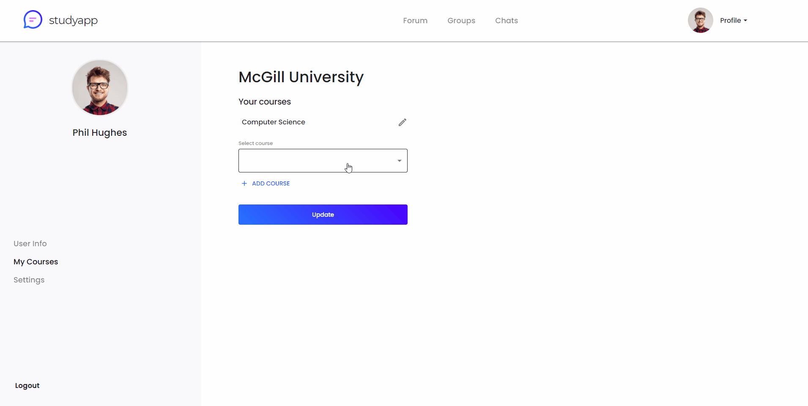
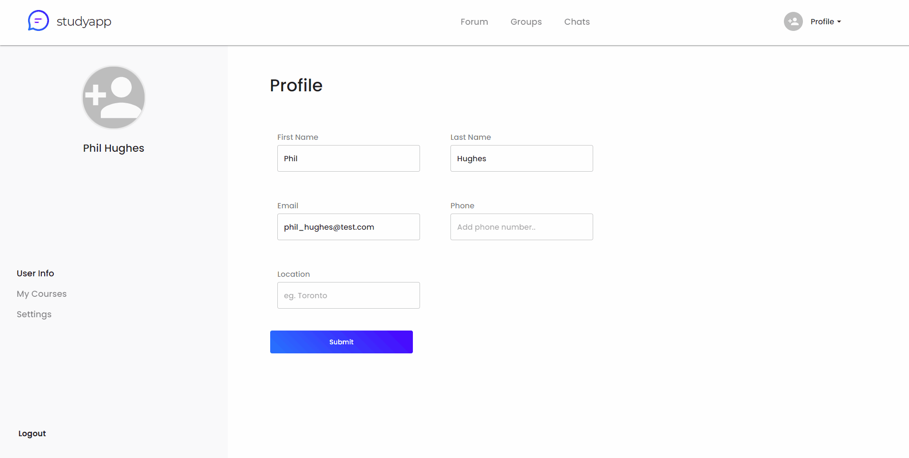
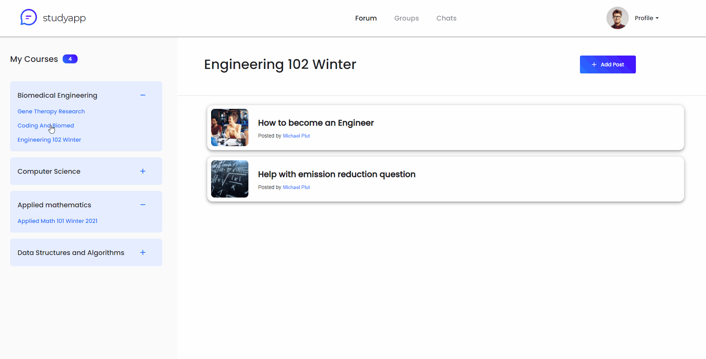
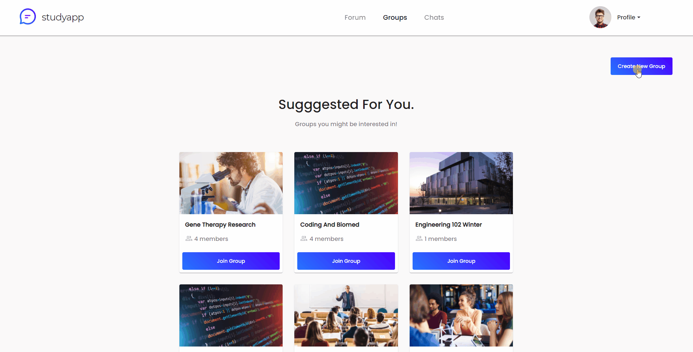

# Express Starter

This starter repo will be used for building applications using React, Material-UI, React-Router, Node, & Express.js.

## Getting started

The project is broken down into a client and server folder.

## Demos

### Creating an account

### Chat functionality with sockets

### Adding and deleting courses

### Adding a photo to the user profile

### Adding comments on forum posts

### Creating a group for students

